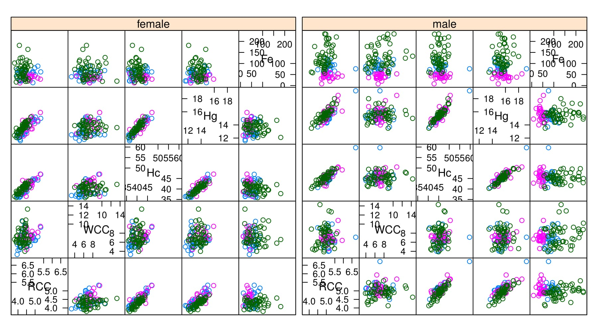
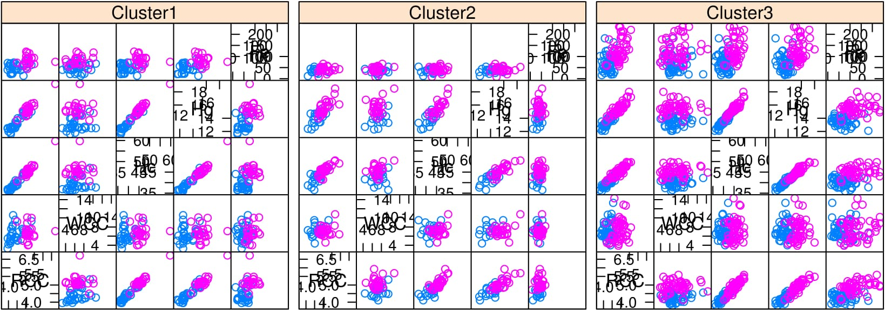

```{r setup, include=FALSE}
options(width = 999)
knitr::opts_chunk$set(fig.width=7, fig.height=7, fig.align = 'center', fig.show='hold',
                      warning=FALSE, message=FALSE, progress=FALSE, collapse=TRUE, comments="#>")
```

## Introduction
__MoEClust__ is an R package which fits finite Mixtures of Experts models with __mclust__ family covariance structures using the EM algorithm, ie. allows incorporation of covariates into the mixing proportions and/or Gaussian densities of finite mixture models under the various covariance parameterisations in the __mclust__ family. It also visualises mixture of experts models with parsimonious covariance parameterisations using generalised pairs plots.

The most important function in the __MoEClust__ package is: `MoE_clust`, for fitting the model via EM with gating and/or expert network covariates, supplied via formula interfaces. Other functions also exist, e.g. `MoE_control`, `MoE_crit`, `MoE_dens`, `MoE_estep`, and `MoE_aitken`, which are all used within `MoE_clust` but are nonetheless made available for standalone use. `MoE_compare` is provided for conducting model selection between different results from `MoE_clust` using different covariate combinations &/or initialisation strategies, etc.

A dedicated plotting function exists for visualising the results using generalised pairs plots, for examining the gating network &/or log-likelihood, and/or graphing model selection criteria values. The generalised pairs plots visualise all pairwise relationships between clustered response variables and associated gating &/or expert network continuous &/or categorical variables, coloured according to the MAP classification, and also gives the marginal distributions of each variable along the diagonal.

An `as.Mclust` method is provided to coerce the output of class `"MoEClust"` from `MoE_clust` to the `"Mclust"` class, to facilitate use of plotting and other functions for the `"Mclust"` class within the __mclust__ package. As per __mclust__, __MoEClust__ also facilitates modelling with an additional noise component.

If you find bugs or want to suggest new features please visit the __MoEClust__ [GitHub issues page](https://github.com/Keefe-Murphy/MoEClust/issues). This vignette aims to demonstrate the __MoEClust__ models via application to well-known univariate and multivariate data sets provided with the package.

### Installing MoEClust
__MoEClust__ will run in Windows, Mac OS X or Linux. To install it you first need to install [R](https://cran.r-project.org/). Installing [Rstudio](https://www.rstudio.com/) as a nice desktop environment for using R is also recommended.

Once in R you can type at the R command prompt:
```{r, eval=FALSE}
install.packages('devtools')
devtools::install_github('Keefe-Murphy/MoEClust')
```
to install the latest development version of the package from the __MoEClust__ [GitHub page](https://github.com/Keefe-Murphy/MoEClust). 

To instead install the latest stable official release of the package from CRAN go to R and type:

```{r, eval=FALSE}
install.packages('MoEClust')
```

In either case, if you then type:
```{r}
library(MoEClust)
```
it will load in all the __MoEClust__ functions.

The GitHub version contains a few more features but some of these may not yet be fully tested, and occasionally this version might be liable to break when it is in the process of being updated.

## CO2 Data
Load the CO2 data.

```{r}
data(CO2data)
GNP   <- CO2data[,1]
CO2   <- CO2data[,2]
```

Fit various mixture models to cluster the CO2 data, allowing the GNP variable enter the gating &/or expert networks, or neither. 

```{r, results='hide', eval=FALSE}
m1    <- MoE_clust(CO2, G=1:2, verbose=FALSE)
m2    <- MoE_clust(CO2, G=1:2, gating= ~ GNP, verbose=FALSE)
m3    <- MoE_clust(CO2, G=1:2, expert= ~ GNP, verbose=FALSE)
m4    <- MoE_clust(CO2, G=1:2, gating= ~ GNP, expert= ~ GNP, verbose=FALSE)
m5    <- MoE_clust(CO2, G=1:2, equalPro=TRUE, verbose=FALSE)
m6    <- MoE_clust(CO2, G=1:2, expert= ~ GNP, equalPro=TRUE, verbose=FALSE)
```

```{r, results='hide', include=FALSE}
m1    <- MoE_clust(CO2, G=1:2, verbose=FALSE)
m2    <- MoE_clust(CO2, G=1:2, gating= ~ GNP, verbose=FALSE)
m4    <- MoE_clust(CO2, G=1:2, gating= ~ GNP, expert= ~ GNP, verbose=FALSE)
m5    <- MoE_clust(CO2, G=1:2, equalPro=TRUE, verbose=FALSE)
m6    <- MoE_clust(CO2, G=1:2, expert= ~ GNP, equalPro=TRUE, verbose=FALSE)
```

```{r, include=FALSE}
load(file="CO2Vignette.rda")
m3    <- resbest$m3
```

Choose the best model among these and examine the results.

```{r}
(comp <- MoE_compare(m1, m2, m3, m4, m5, m6, pick=5))

(best <- comp$optimal)

(summ <- summary(best))
```

Visualise the results for the optimal model using a generalised pairs plot.

```{r}
plot(comp$optimal, what="gpairs", jitter=FALSE)
```

Visualise the density of the mixture distribution.
```{r, echo=FALSE}
res    <- comp$optimal
G      <- res$G
expert <- res$expert
x.name <- names(res$net.covs)
y.name <- names(res$data)
x      <- as.matrix(res$net.covs)
y      <- as.matrix(res$data)
plot(x=x, y=y, main=substitute(atop(paste('CO'[2], " Data"), paste(Mname, ": ", rG, " components  (incl. expert network covariate: GNP)")), list(Mname=res$modelName, rG=G)), ylab=expression('CO'[2]), xlab="GNP", type="n")
x.new  <- setNames(seq(par("usr")[1], par("usr")[2], length=1000), rep("GNP", 1000))
y.new  <- setNames(seq(par("usr")[3], par("usr")[4], length=1000), rep("CO2", 1000))
grid   <- expand.grid(x.new, y.new)
getden <- function(x, y, res) {
  sig  <- res$parameters$variance$modelName
  den  <- do.call(cbind, lapply(seq_len(G), function(k) dnorm(y, predict(expert[[k]], newdata=setNames(data.frame(x), names(x)[1]), type="response"), sqrt(ifelse(sig == "V", res$parameters$variance$sigmasq[k], res$parameters$variance$sigmasq)))))
  apply(matrix(res$parameters$pro, nrow=length(x), ncol=G, byrow=TRUE) * den, 1, sum)
}
mat    <- matrix(getden(grid[,1], grid[,2], res), length(x.new), length(y.new))
image(x.new, y.new, mat, col=c("white", heat.colors(30)[30:1]), xlab="GNP", ylab=paste('CO'[2]), add=TRUE)
box(lwd=1)
contour(x.new, y.new, mat, add=TRUE, col="lightgray")
points(GNP, CO2)
```

Convert from the `"MoEClust"` class to the `"Mclust"` class in order to further visualise the results. Examine the `"classification"` and `"uncertainty"` options.

```{r, fig.height=5.5, fig.width=5.5}
(mod <- as.Mclust(comp$optimal))
plot(mod, what="classification")
plot(mod, what="uncertainty")
```

## AIS Data
Load the Australian Institute of Sports data.

```{r}
data(ais)
hema  <- ais[,3:7]
sex   <- ais$sex
bmi   <- ais$BMI
```

Fit a mixture of experts model to the hematological variables within AIS data, with `sex` and `bmi` in the expert network. This time, allow the printing of messages to the screen.
```{r}
mod   <- MoE_clust(ais[,3:7], G=1:3, expert= ~ sex)
```

Visualise the results for the optimal model using a generalised pairs plot.

```{r}
plot(mod, what="gpairs")
```

Plot the BIC of the visited models and log-likelihood vs. EM iterations of the optimal model.
```{r, fig.height=5, fig.width=5, eval=FALSE}
plot(mod, what="criterion")
plot(mod, what="loglik")
```

```{r, fig.height=5.5, fig.width=5.5, echo=FALSE}
plot(mod, what="criterion", legendArgs=list(cex=0.675), ylim=c(-9250, -3500))
plot(mod, what="loglik")
```

Produce further visualisations with the aid of the `lattice` library.
```{r, eval=FALSE}
require("lattice")
z <- factor(mod$classification, labels=paste0("Cluster", seq_len(mod$G)))
splom(~ hema | sex, groups=z)
```

```{r, out.width=677.5, echo=FALSE, fig.align='center'}

```

```{r, eval=FALSE}
splom(~ hema | z, groups=sex)
```

```{r, out.width=677.5, echo=FALSE, fig.align='center'}

```

## References
C. Fraley and A. E. Raftery (2002). Model-based clustering, discriminant analysis, and density estimation. _Journal of the American Statistical Association_, 97:611-631.
